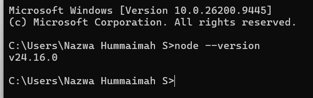
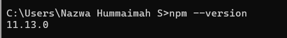
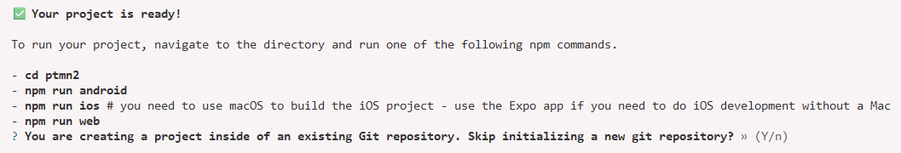
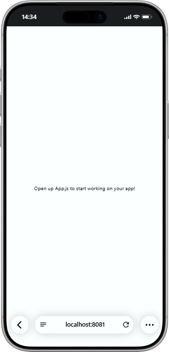
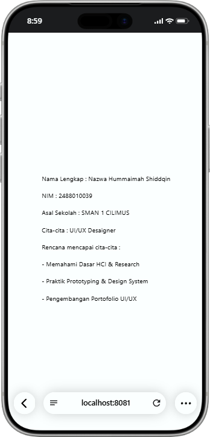

# Praktikum Menyiapkan dan Memulai Pemrograman Mobile (React Native) #

### Tujuan Pembelajaran: ###
Mahasiswa mampu:
1. Menyiapkam dan Memulai Pemrograman Mobile (React Native)
2. Membuat Aplikasi Mobile (React Native)
3. Membuat CV sederhana dengan React Native

### Materi Pembelajaran ###
1. Menyiapkan dan Memulai Pemrograman Mobile (React Native)
- Install Interpreter Node.JS
- Download dan install node.js di alamat https://nodejs.org/en/download/
- Konfirmasi versi node.js
- node -v

- Konfirmasi versi npm 
- npm-v

2. Membuat Aplikasi Mobile (React Native)
- Untuk Referensi Dokumentasi Resmi milik Expo
- https://docs.expo.dev/
- Untuk Referensi Dokumentasi Resmi mikik React Native
- https://reactnative.dev/
- Memulai Membuat projek baru dengan Framework Expo Go
- Change directory ke folder praktikum (Pemrograman Mobile -> Pertemuan-2)
- npx create-expo-app first commit --template blank
- Y Konfirmasi projek baru

3. Menjalankan Aplikasi Mobile (React Native)
- cd ptmn2
- npx  expo starexpo start
- Install Expo go via playstore
- Install Expo  go via app store
- Buka dan Scan QR Code Via Expo Go
- Running via Web Browser Emulator
- ctrl+c untuk menghentikan server
- Sebelumnya install (npx expo install react-dom react-native-web)
- npx expo start--web

4. Tugas Praktikum Pemrograman Mobile(React Native)
- Menambagkan CV sederhana dengan React Native
- Nama Lengkap
- NIM
- Asal Sekolah
- Cita-cita
- Rencana mencapai cita-cita

