# Modul Praktikum 4: Core Components & Styling #

## 🎯 Tujuan Pembelajaran

Setelah menyelesaikan praktikum ini, mahasiswa mampu:

1. Memahami dan menggunakan **16 Core Components** React Native
2. Menerapkan **StyleSheet** untuk styling terpusat
3. Menggunakan **useState** untuk state management dasar
4. Membuat layout yang responsif dengan **Flexbox**
5. Menangani **interaksi pengguna** (tekan, input, scroll)

## Praktikum ##

### Langkah 1: Import Library & Components ###

1. Buka File App.js pada folder projek ptmn2
2. Import Library dan Core Component yang dibutuhkan
3. Konfirmasi Bukti

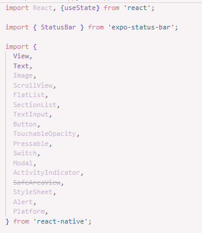

### Langkah 2: Menyiapkan Array Objek untuk menampung data ###

1. Membuat Array objek bernama PROFILE untuk Menampung Data profile
2. Konfirmasi Bukti

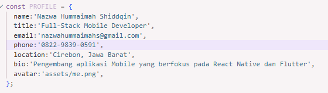

3. Membuat Array objek bernama SKILLS untuk Menampung Data profile
4. Konfirmasi Bukti

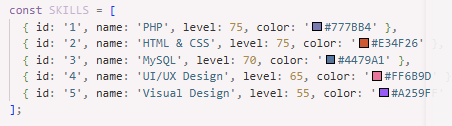

5. Membuat Array objek bernama SECTION untuk Menampung Data profile
6. Konfirmasi Bukti

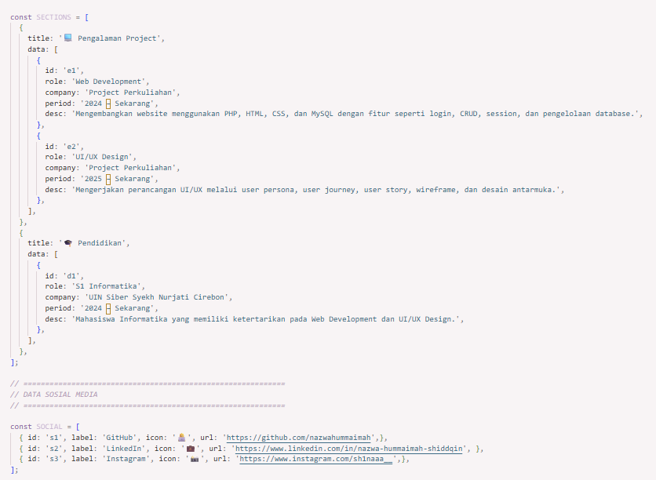

### Langkah 3: Membuat Sub-Components ###
1. Membuat sub-component skillcard dan Timline card untuk menampilkan data skill serta riwayat pengalaman/pendidikan
2. Sub component digunakan agar kode lebih terstruktur dan komponen dapat digunakan kembali
3. Konfirmasi Bukti

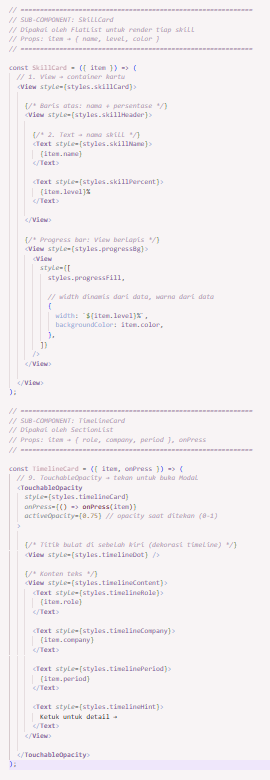

### Langkah 4: State Management dengan useState
1. Menambahkan useState untuk menyimpan data yang dapat berubah pada aplikasi
2. State digunakan untuk mengatur kondisi seperti status Open to work, form input, loading dan modal
3. Setiap perubahan state akan menyebakan komponen melakukan re-render
4. Konfirmasi Bukti

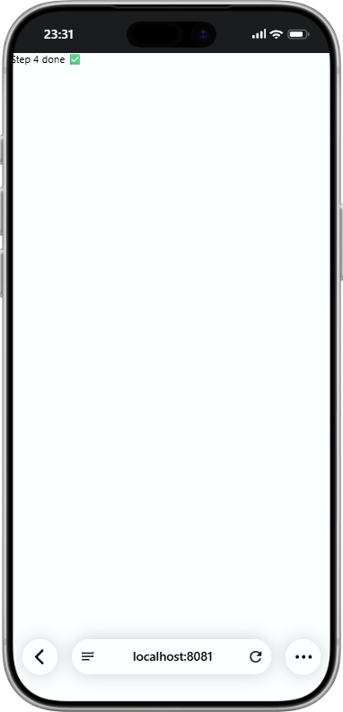

### Langkah 5: SafeAreaView, StatusBar & Header
1. Menggunakan SafeAreaView untuk memastiokan tampilan aplikasi berada pada area aman perangkat
2. Menggunakan StatusBar untuk mengatur tampilan statur bar pada bagian perangkat
3. Membuat header menggunakan View dan Switch
4. Switch digunakan untuk mengubah status Open to Work
5. Konfirmasi Bukti

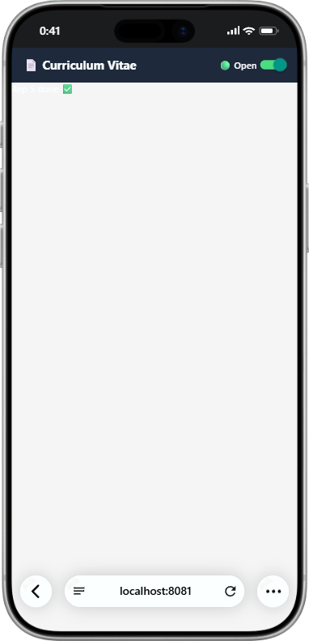

### Langkah 6: ScrollView & Profil Section ###
1. Menggunakan ScrollView untuk membuat seluruh isi CV dapat digulir
2. Menampilkan foto profil menggunakan komponen gambar
3. menampilkan informassi profil seperti nama, jabatan, dan bio menggunakan Text
4. menambahkan tombol media sosial menggunakan komponen interaksi pengguna
5. Konfirmasi Bukti

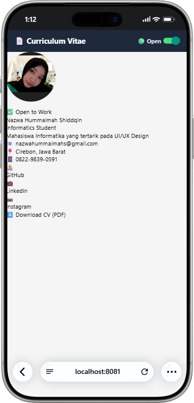

### Langkah 7: flatlist-Daftar Skills ###
1. Menampilkan data skills menggunakan komponen FlatList
2. FlaytList digunkan untuk menampilkan data dalam bentuk daftar secara lebih efisien
3. Data yang ditampilkan berasal dari array objek SKILLS
4. Setiap skill ditampilkan dalam bentuk card yang memiliki progress bar sesuai persentase kemampuan
5. Konfirmasi Bukti

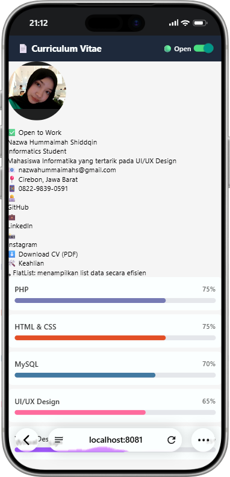

### Langkah 8: SectionList-Pengalaman & pendidikan ###
1. Menampilkan data pengalaman dan pendidikan menggunakan SectionList
2. Data dikelompokkan berdasarkan kategori atau section
3. Section digunakan untuk memisahkan bagian pengalaman kerja atau organisasi dan riwayat pendidikan
4. Setiap data ditampilkan menggunakan TimelineCard
5. Konfirmasi Bukti

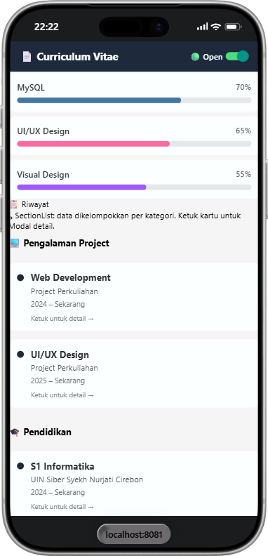

### Langkah 9: TextInput, Button & ActivityIndicator ###
1. Membuat form kontak menggunakan TextInput untuk menerima input dari pengguna
2. Menggunakan Button sebagai tombol untuk mengirim pesan.
3. Menggunakn ActivityIndicator sebagai indikator ketika proses pengiriman sedang berlangsung
4. Input nama dan pesan dikontrol menggunakan state
5. Setelah tombol kirim ditekan, aplikasi menampilkan proses loading kemudian memberikan
6. Konfirmasi Bukti

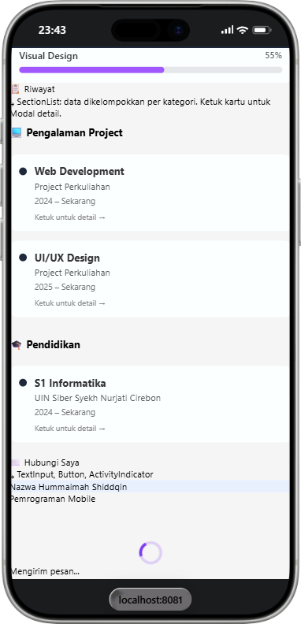

### Langkah 10: Modal-Popup Detail
1. Menambahkan komponen Modal untuk menampilkan detail riwayat
2. Modal ditampilkan ketika pengguna menekan kartu riwayat
3. Modal menggunakan animasi slide sehingga muncul dari bagian bawah layar
4. Menambahkan tombol Tutup untuk menutup modal
5. Konfirmasi Bukti

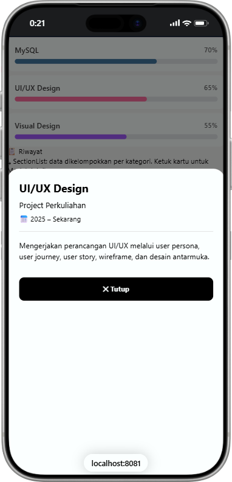

### Langkah 11: StyleSheet-Styling Terpusat ###
1. Mmebuat konstanta warna untuk mengatur palet warna aplikasi
2. Menggunakan StyleSheet.create() untuk mengatur seluruh tampilan aplikasi secara terpusat 
3. Styling diterapkan pada bagian header, profil, sosial media, section, skill card, timeline card, form input, loading, dan modal.
4. Penggunaan StyleSheet membuat kode styling lebih terorganisir dan mudah dikelola.
5. Konfirmasi Bukti

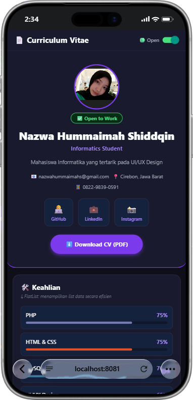

### Langkah 12: Verifikasi & Pengujian
1. Menjalankan aplikasi untuk memastikan seluruh komponen dan fitur dapat digunakan dengan baik
2. Melakukan pengujian terhadap tampilan profil, scrolling, switch, daftar skills, riwayat, form kontak, modal, dan tombol sosial media 
3. Hasil pengujian disesuaikan dengan fungsi dibuat pada aplikasi
4. Konfirmasi Bukti

